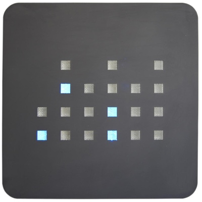

# BinaryClock

This project is a simple demonstration of one way to create a binary clock in HTML and Javascript.

The type of clock imagined here looks like:

\

Binary clocks typically use a 24 hour clock and display the time by representing each digit of each component with its binary equivalent using a column of 4 rows, each row representing a power of 2 (2^0 thru 2^3). In decimal, each column to represents a decimal number from 0 to 15.

| 2^n | H | H | M | M | S | S |
|:--|:--|:--|:--|:--|:--|:--|
| 3 | - | 0 | - | 1 | - | 1 |
| 2 | - | 0 | 0 | 0 | 1 | 0 |
| 1 | 1 | 0 | 1 | 0 | 0 | 0 |
| 0 | 0 | 0 | 1 | 1 | 1 | 1 |

Notice that some time components can't go as high as the binary column is capable of representing. Columns where the decimal place for that time component can't go that high are displayed as "-" to denote that those bits aren't used.

For example, 12 PM is the same as 24:00 hrs.  The 10's place for the hour, 2, only goes from 0 to 2 so we show 2^2 and 2^3 in that column as "-" because they will never be used.  

Likewise, because the other components, both minutes and seconds, can go from 0 to 59, the 10's places for those components only goes from 0 to 5. So powers of 2 greater than 5 are also blocked off ("-") because they won't be used.

The 1s place for all components can go from 0 to 9, so we need all the binary places to represent that range - recall that the highest bit, 2^3, equals 8, so we need all 4 places.

In the example above, the time can be read by converting the respective powers of 2 to decimal for each 10's place in each component, following the pattern HH:MM:SS.

HH: 2^1 : 0 == 20\
MM: 2^0 + 2^1 : 2^0 + 2^3 == 39\
SS: 2^0 + 2^2 : 2^0 + 2^3 == 59

Time: 20:39:59 hrs or 8:39:59 PM
